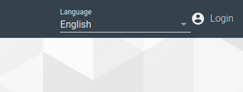
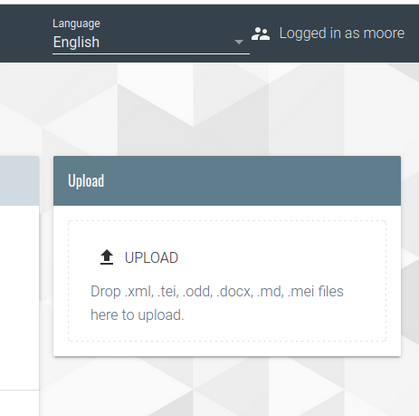

# Marianne Moore Archive


## Requirements

*   [exist-db](http://exist-db.org/exist/apps/homepage/index.html) version: `5.3` or greater

*   [ant](http://ant.apache.org) version: `1.10.7` \(for building from source\)

### Building from source

1.  Download, fork or clone this GitLab repository  
2.  Build the application by calling `ant`. E.g.:
```bash
cd moore-app
ant
```

If you see `BUILD SUCCESSFUL` ant has generated a `moore-0.1.xar` file in the `build/` folder.
To install it, follow the instructions [below](#installation).

## Installation 

1.  Open the Dashboard of your eXist-db instance and click on `package manager`.

2. Click on the `add package` symbol in the upper left corner and select the `.xar` files you created in the instructions [Building from source](#building-from-source).

3. Open the web application.

## Use the Docker .devcontainer

1. Make sure you have [Visual Studio Code](https://code.visualstudio.com/) and [Docker Desktop](https://www.docker.com/products/docker-desktop/) installed on your local computer.
2. Start `Docker`
3. open this folder in Visual Studio Code which will show you a `Reopen in Container` button once its started. Click this button and wait till everything got installed. Once everything is finished you can access the eXist-db at `localhost:8080/exist`. 

## Customization of the app

### Adding new texts

Through the interface:

1. Log in with an user that belongs to the `tei` group (e.g. the already existing `moore` user): 



2. Upload the file using the Upload dialog:



3. To upload the facsimiles, go to eXide (e.g. http://localhost:8080/exist/apps/eXide/index.html) and click on `File > Manage` (make sure to be logged in with a user that belongs to the `tei` group). There, upload the images to `apps/moore/resources/images/notebooks`

Locally:

1. Add the XML files to `data/notebooks` and the images to `resources/images/notebooks`

2. Build the app from source (see above) and deploy the new version of the .xar file.

### ODD-generated content

- The project has one main ODD:
    - **moore.odd** (`resources/odd`)

- The CSS file that adds additional styling to elements generated by the ODD is in the same folder: **moore.css** For example, there you can see the styling of the different editorial conventions:

```
.unclear {
    background-color: #D8D8D8;
}

.underline {
    text-decoration: underline;
}
```

### HTML Templates

HTML files are in the folder `templates`. Most relevant files:

- **index.html**: landing page
- **menu.html**: menu
- **facsimile.html** (in the folder `templates/pages`): template use for rendering the notebooks

### Styling 

The main CSS file at the moment is **theme.css** in `resources/css`.

### Images

Images are stored in `resources/images`. The facsimiles are here in the subfolder `notebooks`.

### Internationalization

If the app is only going to be offered in English, the language selector should be taken out from the menu. If, however, more languages are to be added, we need to have a JSON file for each language in `resources/i18n/app`. The element to use in the HTML files to display its contents in different languages is [`pb-i18n`](https://unpkg.com/@teipublisher/pb-components@2.23.2/dist/api.html#pb-i18n.0)